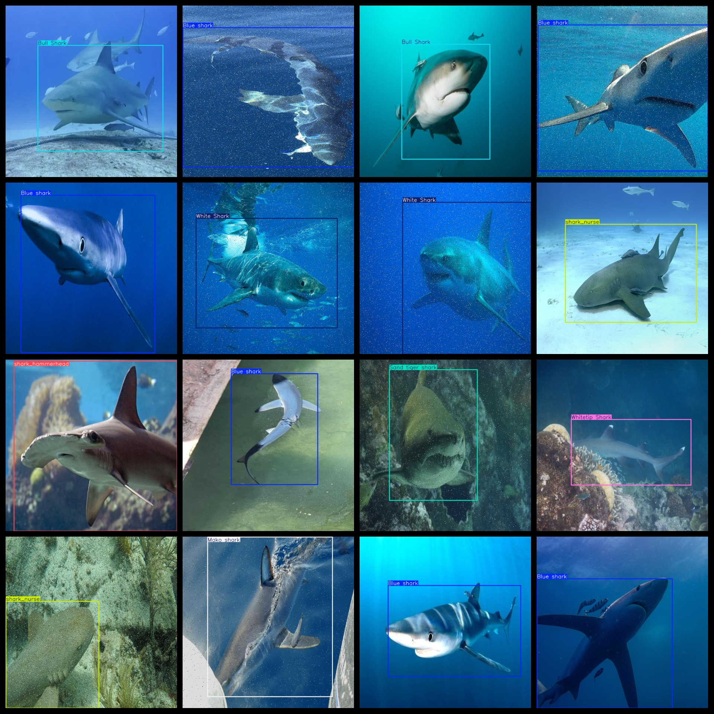
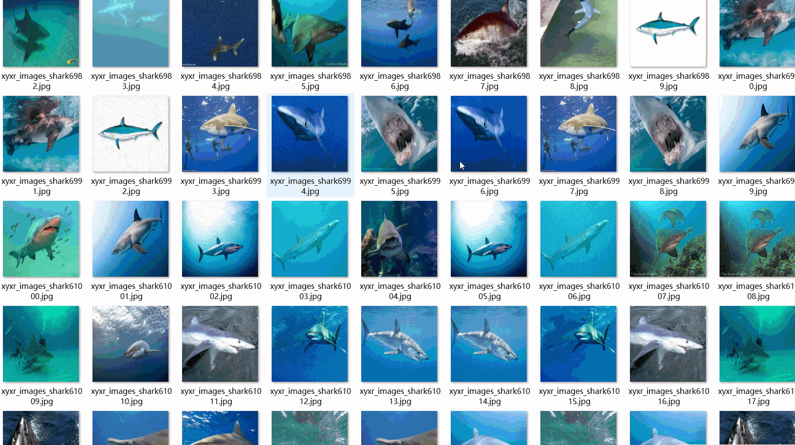

# 10 typesShark Classification Recognition Detection Dataset 5034 imagesVOC+YOLO format

10 shark taxonomy detection datasets 5034 VOC + YOLO format

Dataset Format: VOC format + YOLO format

The compressed file contains: three folders, each storing images, xml files, and text files.

Total jpg images in JPEGImages folder: 5084

The total number of XML files in the Annotations folder is: 5084.

The total number of txt files in the labels folder is 5084.

Number of tag types: 10

Tag names: ["Blue shark","Bull Shark","Mako shark","Sand tiger shark","White Shark","Whitetip Shark","shark_hammerhead","shark_nurse","shark_tiger","shark_whale"]

The number of boxes for each label (Note that the order of labels in the Yolo format does not correspond to this, but is based on the classes.txt file in the labels folder):

Blue shark frame count = 530

Bull Shark frame count = 572

Mako shark frame count = 514

Sand tiger shark frame count = 622

White Shark frame count = 509

Whitetip Shark frame count = 536

shark_hammerhead frame count = 699

shark_nurse frame count = 560

shark_tiger frame count = 524

shark_whale frame count = 541

Total boxes: 5607

Picture clarity (Resolution: Pixels): Clear

Image Enhancement: Yes

Shape of the label: Rectangular box, used for object detection and recognition.

Important Note: None

Special Notice: This dataset does not guarantee the accuracy or precision of the trained models or weight files. The dataset only provides accurate and reasonable annotations.

Annotation and image details are as follows:

## Images

---

Here is a pay link on Stripe (https://buy.stripe.com/3cs8yP7sY87d0vu9AB). Please contact me lonlonago@foxmail.com after funding $89, and I will send you a complete data files, thank you!

